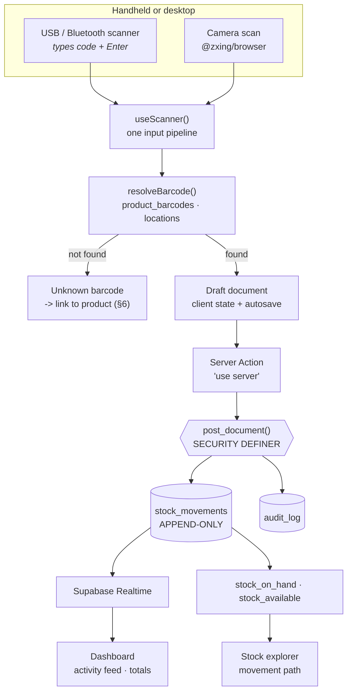

# Onest WMS — Phase 1 Plan

> **Status:** Proposal — awaiting approval. No UI code written yet.
> **Prepared:** 2026-08-11
> **Prerequisite:** Phase 0 closed — schema live locally, on the hosted Singapore project,
> and rebuilt from zero by CI on every push. 31 tests green.

Phase 0 built a database that refuses to be wrong. Phase 1 puts a screen in front of it:
receive stock with a scanner, gate it through QC, find anything by barcode, and see the
whole warehouse on one page. This is the first phase a warehouse worker can actually use.

---

## Table of contents

1. [Where Phase 0 finished](#1-where-phase-0-finished)
2. [The acceptance test that defines this phase](#2-the-acceptance-test-that-defines-this-phase)
3. [Scope — seven screens](#3-scope--seven-screens)
4. [Architecture](#4-architecture)
5. [The scan engine](#5-the-scan-engine)
6. [Barcode identity and capture](#6-barcode-identity-and-capture)
7. [Goods receipt in detail](#7-goods-receipt-in-detail)
8. [QC review queue](#8-qc-review-queue)
9. [Stock explorer](#9-stock-explorer)
10. [Dashboard v1](#10-dashboard-v1)
11. [Label printing](#11-label-printing)
12. [Internationalisation](#12-internationalisation)
13. [PWA and offline posture](#13-pwa-and-offline-posture)
14. [Decisions proposed](#14-decisions-proposed)
15. [Tests](#15-tests)
16. [Definition of done](#16-definition-of-done)
17. [Open questions](#17-open-questions)
18. [Carried forward from Phase 0](#18-carried-forward-from-phase-0)

---

## 1. Where Phase 0 finished

The foundation runs in three places, and the third is the one that matters most: GitHub
Actions independently rebuilds the entire schema from an empty database on every push, so
the migrations can never quietly become un-rebuildable.

| Verified | Detail |
|---|---|
| 44 tables, 8 views, 100 RLS policies | RLS enabled on every table. `stock_movements` and `audit_log` have no write policy at all — the ledger is reachable only through `post_document()`. |
| 31 tests, green in CI | Append-only enforcement, per-bin sufficiency, all four movement classes, scrapping a failed lot, settling consignment stock, shipping from staging, negative override, numbering, status workflow, full receive-to-issue loop. |
| The seed proves the ledger | `OPENING-WH01` holds −17,792.63; the real bins hold +17,792.63. Every unit of opening stock traces to the movement that created it. |

Phase 1 adds no new invariants. Everything it does routes through the guarantees that
already exist.

---

## 2. The acceptance test that defines this phase

**A full goods receipt, completed with the mouse unplugged.**

Every scan screen is built against this. If a step needs the mouse, the step is wrong.

| Input | Result |
|---|---|
| **SCAN** location barcode | Bin confirmed, focus jumps to the product field |
| **SCAN** product barcode | SKU resolved, focus jumps to quantity |
| **0–9** | Quantity on the number pad, or the on-screen keypad on mobile |
| **ENTER** | Line committed, audible beep, focus returns to the product field |
| **SCAN** | Next item — no navigation between lines |
| **F9** | Post. Confirmation dialog answerable with Enter |

The same discipline applies on a phone: large touch targets, an on-screen numeric keypad
rather than the system keyboard, and camera scanning feeding the identical input handler as
the USB scanner. **One input pipeline, two hardware paths.**

---

## 3. Scope — seven screens

Ordered by dependency. Each is usable before the next is started, so you react to real
screens rather than to a plan.

| # | Screen | Users | Device |
|---|---|---|---|
| 1.1 | Auth, shell, Thai/English switching | everyone | both |
| 1.2 | Master data CRUD | admin, manager | desktop |
| 1.3 | Label printing | admin, manager, staff | desktop |
| 1.4 | Scan engine (shared component, not a screen) | — | both |
| 1.5 | Goods receipt · ใบรับสินค้า | staff | handheld |
| 1.6 | QC review queue | qc | both |
| 1.7 | Stock explorer + dashboard v1 | everyone | both |

### 1.1 Auth, shell, i18n

Supabase Auth email/password login, session handling in Next middleware, role-aware
navigation, and next-intl wired end to end. Thai is the default locale.

Every string ships in both languages from the start. Retrofitting i18n is what makes it
never happen.

### 1.2 Master data CRUD

Products (with barcodes, UOM conversions, min/max rules), locations, partners, departments,
lots. Table views with search and filter, plus a form drawer for edit. Desktop-first — this
screen is used at a desk, not on a handheld.

Writes go through the existing RLS policies; nothing here needs new server-side machinery.

### 1.3 Label printing

See §11.

### 1.4 Scan engine

See §5.

### 1.5 Goods receipt

See §7.

### 1.6 QC review queue

See §8.

### 1.7 Stock explorer and dashboard

See §9 and §10.

---

## 4. Architecture

The important property: **the browser never writes to the ledger and never holds a
service-role key.** A scan resolves through a read query; posting goes through a server
action that calls the same RPC the Phase 0 tests exercise.



### Client/server split

| Concern | Where | Why |
|---|---|---|
| Reading stock, products, locations | Client, via Supabase JS with the anon key | RLS is the protection; views are `security_invoker` so policies still apply |
| Barcode resolution | Client read query | Must be fast enough to feel instant on a scan |
| Draft document writes | Client, via RLS-protected inserts | Documents in `draft` are editable by their creator — the policy already allows exactly this |
| **Posting** | **Server action → `post_document()`** | The only path to the ledger. Permission checks live in the RPC. |
| Anything needing elevated rights | Server action | The service-role key never reaches the browser |

---

## 5. The scan engine

Not a screen — the shared component every scan screen is built from. Building it once is
what makes screens 1.5 onward small.

### Two hardware paths, one pipeline

A keyboard-wedge scanner types characters and presses Enter. Camera scanning produces a
string from a video frame. Both feed `useScanner()`, so every downstream screen is written
once and works with either.

**Wedge detection.** A human typing and a scanner "typing" both produce keystrokes. The
scanner is distinguished by inter-keystroke timing — a burst of characters faster than
human typing, terminated by Enter. The handler buffers keystrokes, and on Enter decides
whether the buffer was a scan or manual entry.

### Responsibilities

| Concern | Behaviour |
|---|---|
| **Resolution** | Look up `product_barcodes.barcode`, then `locations.barcode`. A barcode is globally unique across products, so one scan resolves to exactly one thing. |
| **UOM awareness** | A case barcode carries its own `uom_id`. Scanning a case means one case, not one piece — the quantity field defaults accordingly. |
| **Feedback** | Distinct audio tones for accept and reject, plus a colour flash. A warehouse is loud; a worker must be able to tell a good scan from a bad one without reading. |
| **Focus** | After every accepted scan, focus moves to the next field automatically. The worker never reaches for the mouse. |
| **Errors in Thai** | "ไม่พบบาร์โค้ดนี้" not "resolve failed". Error text is written for a warehouse worker, not a developer. |
| **Duplicate suppression** | The same code scanned twice within a short window is one scan, not two lines. Scanners bounce. |

### Camera scanning

`@zxing/browser` — maintained, reads Code 128 and QR, no licence needed. It sits behind the
same interface as the wedge input, so replacing it later touches one file.

---

## 6. Barcode identity and capture

**AccCloud returns no barcode data from any endpoint** (D-24). Barcode identity is
therefore entirely ours, and the system cannot scan anything until we put barcodes on
things. That makes barcode capture explicit Phase 1 scope rather than an assumed detail.

Two mechanisms:

1. **Internal barcodes, assigned and printed by us.** Every SKU gets a `product_barcodes`
   row with `type = 'internal'`, `is_primary = true`, printed via screen 1.3.

2. **Supplier barcodes, captured at first receiving.** When a scan resolves to nothing
   during a goods receipt, the receiver is offered *"link this barcode to a product"*
   rather than a dead end. Choosing a product writes a `type = 'supplier'` row, and the
   next delivery from that supplier scans natively.

The second is the one that matters operationally: it turns the unknown-barcode error state
from a failure into the mechanism by which the system learns. No separate data-entry
project, no spreadsheet of supplier barcodes — the warehouse teaches it during normal work.

---

## 7. Goods receipt in detail

Thai: **ใบรับสินค้า**. Document prefix `GR`. Posts on scan completion, with no separate
approver (D-22).

### Flow

```
1. Receiver opens the receiving screen. Supplier optional, PO reference optional.
2. SCAN destination bin        -> defaults to RECV-01, overridable by scanning another bin
3. SCAN product barcode        -> resolves SKU and its UOM
   3a. unknown barcode         -> "link this barcode to a product" (§6)
4. If lot-tracked:             -> lot number field, then expiry
                                  (expiry pre-filled from shelf_life_days; the receiver
                                   confirms rather than calculates)
   If serial-tracked:          -> scan or type each serial, qty forced to 1
   If untracked:               -> straight to quantity
5. TYPE quantity               -> numeric keypad
6. ENTER                       -> line committed, beep, focus back to the product field
7. Repeat from 3
8. F9                          -> post via post_document()
```

### Routing

A product with `requires_qc = true` lands in `qc_hold` and its lot is created
`pending_qc` — automatically, without the receiver choosing anything. Everything else goes
to the scanned destination bin.

This is the QC gate doing its job at the point of entry: the receiver cannot accidentally
put unapproved stock into pickable storage, because the destination is decided by the
product's own configuration.

### Draft safety

Lines are written to `goods_receipt_lines` as the receipt is built, not held only in
browser memory. A dropped connection, a dead battery or a closed tab mid-receipt loses
nothing — the draft is waiting when the receiver comes back.

---

## 8. QC review queue

The other half of the receiving story, and the screen that makes D-14 real.

| Element | Behaviour |
|---|---|
| **Queue** | Lots with `qc_status = 'pending_qc'`, oldest first, with age prominently displayed — a lot sitting for days is the thing worth seeing |
| **Actions** | Pass / Fail / Quarantine, restricted to the `qc` role by `lot.set_qc_status` |
| **Effect of Pass** | The lot becomes available everywhere at once, including stock already put away |
| **Effect of Fail** | Stock stays visible but becomes unissuable everywhere |
| **Scrap** | A failed lot can be written off directly from this screen, because `qc` holds both `lot.dispose_unpassed` and `adjustment.post` (D-20) |

The scrap action is why a failed lot is not trapped in the warehouse forever — the thing
the original posting design got wrong, now reachable from the screen where the problem is
discovered.

---

## 9. Stock explorer

Scan or search any product or location barcode, and see everything about it.

| View | Content |
|---|---|
| **By product** | On-hand across every bin and lot, with available vs. total, in-QC, in-transit and at-consignment broken out |
| **By location** | Everything in this bin, with lot and expiry |
| **Movement path** | Every hop for a product, lot or serial: from, to, when, who, which document, which device |

The movement path is the payoff of the whole ledger design (D-01, D-02). Because one
physical hop is one row, history reads as a path — `NULL → QC-HOLD-01 → IN-TRANSIT →
PICK-01 → NULL` — rather than as pairs of half-entries a reader has to reassemble. The view
`stock_movement_path` already resolves location codes and user names, so this screen is
mostly presentation.

---

## 10. Dashboard v1

Live via Supabase Realtime on `stock_movements`. Clean enough for a management viewer, and
mobile-responsive.

| Panel | Content |
|---|---|
| **Stock totals** | On-hand, available, in QC, in transit, at consignment sites |
| **Receipts posted today** | Count and total lines, each receipt one click from its lines and movements — **required by D-22** |
| **Activity feed** | Live movements as they post, including `goods_receipt` posts, with who and from which device — **required by D-22** |
| **Alerts summary** | Placeholder in Phase 1; the engine is Phase 3 |
| **Expiry timeline** | From `expiry_horizon`: expired, within 30 / 60 / 90 days |
| **Fast/slow movers** | From `movement_velocity`, 30- and 90-day windows |

### Why two of these panels are non-negotiable

Goods receipts post the moment scanning finishes, which removes the second pair of eyes
every other document has. That was the right call for a scanner-only workflow, but the risk
does not vanish because the trade was reasonable. **"Receipts posted today" and
`goods_receipt` in the activity feed are the compensating control** — they move the review
from before the fact to after it, which is honest, rather than pretending no review is
needed. A manager scanning this page each morning sees everything that entered the
warehouse yesterday.

---

## 11. Label printing

Code 128 for internal codes, QR optional. Rendered as browser-printable pages.

| Label | Default size | Contents |
|---|---|---|
| Product | 100 × 50 mm | SKU, Thai name, barcode |
| Lot | 100 × 50 mm | SKU, lot number, expiry, barcode |
| Location | 50 × 25 mm | Bin code, barcode |

Sizes are configurable in `settings`. Since no printer is bought yet, Phase 1 targets **A4
sheets of labels**, which work on any office printer; a direct-to-printer path follows once
hardware exists.

**Design for the printer we do not own yet.** A `LabelRenderer` interface with an HTML
implementation now, so a ZPL/Zebra driver drops in later without touching a single caller.

---

## 12. Internationalisation

Thai is the default. Both languages ship together, from the first screen.

Document names carry their Thai equivalents throughout:

| English | Thai |
|---|---|
| Goods receipt | ใบรับสินค้า |
| Requisition | ใบขอเบิก |
| Issue slip | ใบเบิก |
| Transfer | ใบโอนย้าย |
| Delivery note | ใบส่งสินค้า |
| Adjustment | ใบปรับปรุงสต๊อก |
| Count sheet | ใบตรวจนับ |

Dates display in Asia/Bangkok. The Buddhist-era toggle exists in `settings` from Phase 0;
Phase 1 wires it into printed document views.

---

## 13. PWA and offline posture

Installable on Android and iOS: manifest, icons, service worker, standalone display.

**Phase 1 ships graceful reconnect, not full offline.** Scans queue in memory while the
connection is down, a visible banner shows the state, and the queue flushes on recovery.

True offline posting needs conflict rules — what happens when two handhelds post against
the same bin while both are disconnected — and inventing those before seeing real usage
would be guessing. The brief asks for "offline-tolerant where feasible; at minimum,
graceful reconnect", so this is the specified floor. Say the word if you want the ceiling.

---

## 14. Decisions proposed

Each of these will be recorded in `DECISIONS.md` when accepted.

| # | Area | Proposal | Reversible? |
|---|---|---|---|
| P1-A | **Draft storage** | A scan session is saved to the document tables as a `draft` on every line, not only at the end. A dropped connection mid-receipt loses nothing. | Easily |
| P1-B | **Offline tolerance** | Graceful reconnect with an in-memory queue, not full offline posting. See §13. | Design now |
| P1-C | **Camera library** | `@zxing/browser`, behind the same interface as the wedge input. | Easily |
| P1-D | **Label sizing** | 100×50 mm product/lot, 50×25 mm bin, configurable; A4 sheets until a printer exists. | Easily |
| P1-E | **Deployment** | Vercel connected to `main`, hosted Supabase keys in Vercel's environment variables — never in the repo. Previews point at the same hosted database until a staging project earns its cost. | Ask first |

---

## 15. Tests

Phase 0's 31 tests keep running unchanged. Phase 1 adds a layer above them, because the
risks have moved: the database is proven, so the new failure modes are in resolution,
permissions and the scan pipeline.

- **Barcode resolution** — a scan resolves to exactly one product; an unknown code produces
  the Thai error state rather than a silent no-op; a case barcode resolves to its own UOM,
  not to pieces
- **Supplier barcode capture** — linking an unknown barcode writes a `type = 'supplier'`
  row and the same code resolves natively on the next scan
- **RLS from the client's seat** — a `viewer` session cannot insert a document, cannot post,
  and never sees a service key; a `qc` session can pass a lot but not create a receipt
- **Receipt flow, end to end** — driving the receiving screen entirely through simulated
  scanner input, asserting the resulting movements
- **QC routing** — a product with `requires_qc` lands in `qc_hold` with a `pending_qc` lot,
  without the receiver choosing anything
- **Label rendering** — a Code 128 label carries the right payload and survives the print
  stylesheet

---

## 16. Definition of done

Phase 1 is complete when all of the following are true:

1. A warehouse worker completes a full goods receipt using only a scanner and number keys,
   on a handheld, in Thai — verified by someone other than the developer
2. A QC user passes a lot and watches it become available; fails another and watches it
   become unissuable everywhere; scraps the failed one from the same screen
3. Any product or bin barcode scanned in the stock explorer returns on-hand and full
   movement history
4. The dashboard shows live totals, receipts posted today, and an activity feed that
   updates as a receipt posts on another device
5. Product, lot and location labels print legibly and scan back successfully
6. Every screen renders in Thai and English
7. The app installs as a PWA on an Android phone
8. CI green: lint, typecheck, format, migrations from zero, and the full test suite

---

## 17. Open questions

None block screens 1.1 and 1.2, so work can start immediately.

| # | Question | Needed by |
|---|---|---|
| 1 | **Onest brand colours and logo** — hex values and a logo file if a brand guide exists. Otherwise I build a high-contrast warehouse theme tuned for a cheap handheld under fluorescent light, and we re-skin later. | Screen 1.1 |
| 2 | **Who gets a login on day one?** Real names, emails and roles. The seed's eight demo users get replaced before go-live. Rough list is fine — I need the shape, not the final roster. | Screen 1.1 |
| 3 | **Existing barcodes on incoming goods** — do your SKUs arrive carrying supplier barcodes worth scanning, or does everything get an internal Onest label? A photo of a typical incoming drum label would answer it completely. Note this is now partly answered by §6: the capture flow works either way, but knowing the reality changes how prominent it should be. | Screen 1.5 |
| 4 | **Vercel deployment** — connect the repo now, so you can open the app on a phone as it is built? Needs the hosted Supabase keys in Vercel's environment settings. | Your call |
| 5 | **The AccCloud export file** — still outstanding. Not blocking, but real column names improve the Phase 4 importer, and may reveal UOM data relevant to question 3. Save it anywhere and send the path. | When convenient |

---

## 18. Carried forward from Phase 0

| Item | Detail |
|---|---|
| **Database password in a transcript** | The Supabase database password was pasted in plain text and lives wherever this conversation is stored. Not in git, not public. Rotating it is one click on Project Settings → Database; worth doing before go-live at the latest. |
| **AccCloud keys being reset** | The owner is regenerating the exposed API keys and will place fresh ones in `.env.local`. `.env.example` and `.env.local` already carry the correct variable names. |
| **Count variance on unpassed stock** | A cycle-count variance that decreases a `pending_qc` lot classifies as disposal, so it needs `lot.dispose_unpassed` — a warehouse manager cannot post it alone. Defensible, but a real constraint. Becomes concrete in Phase 3. |
| **`prodConvFactor` direction** | Unresolved (D-24). The Phase 4 importer will show computed conversions in the diff preview rather than committing blind. |
| **`masterId` vs `productMaster1Id`** | Unresolved (D-24). The importer asserts they agree on first import and refuses to commit if they do not. |
