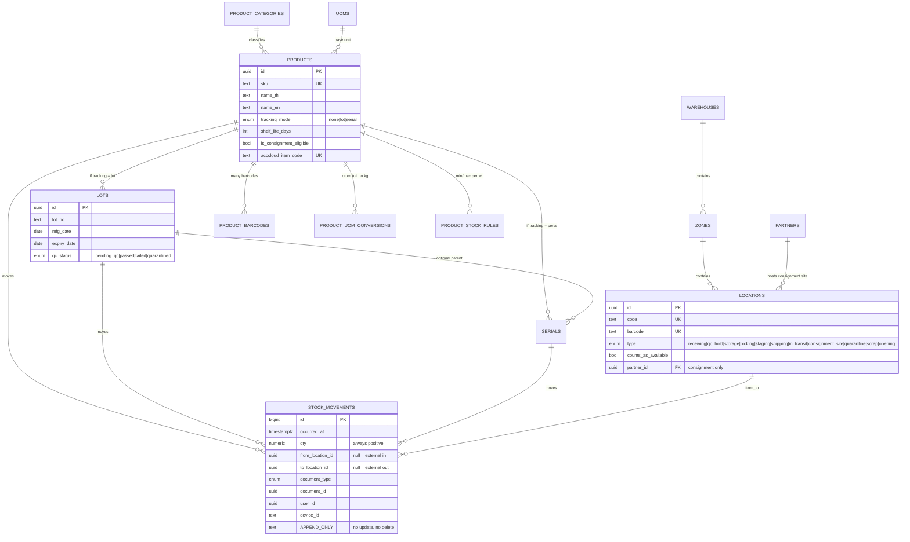
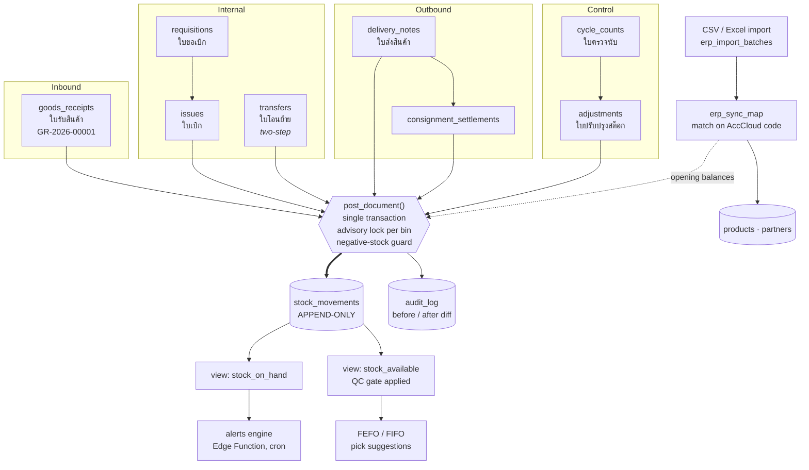

# Onest WMS — Phase 0 Plan & Schema

> **Status:** Proposal — awaiting approval. No migrations written yet.
> **Prepared:** 2026-08-10
> **Scope:** 1 warehouse, <500 SKUs, plus consignment customer sites.

This document is the specification for Phase 0. It covers what Phase 0 delivers, the
complete proposed database schema, the invariants the database enforces on its own, the
access model, and the questions that block the start of work.

Phase 0 is deliberately **backend-only**. The intent is that by the time any UI exists, it
is impossible for a screen — or a bug in a screen, or a future developer — to corrupt
stock. The guarantees live in Postgres, not in React.

---

## Table of contents

1. [Deliverables](#1-deliverables)
2. [The ledger contract](#2-the-ledger-contract)
3. [Schema — master data](#3-schema--master-data)
4. [Schema — lot & serial tracking](#4-schema--lot--serial-tracking)
5. [Schema — the ledger](#5-schema--the-ledger)
6. [Schema — documents](#6-schema--documents)
7. [Schema — audit, alerts, sync, settings](#7-schema--audit-alerts-sync-settings)
8. [Views](#8-views)
9. [Posting: `post_document()`](#9-posting-post_document)
10. [Access model & RLS](#10-access-model--rls)
11. [Document numbering](#11-document-numbering)
12. [Seed data](#12-seed-data)
13. [Repo, CI, conventions](#13-repo-ci-conventions)
14. [Tests in Phase 0](#14-tests-in-phase-0)
15. [Decisions recorded](#15-decisions-recorded)
16. [Open questions](#16-open-questions)
17. [Known environment gaps](#17-known-environment-gaps)

---

## 1. Deliverables

| # | Deliverable | Detail |
|---|---|---|
| 01 | **Repo scaffold + CI** | Next.js 14 App Router, TypeScript strict, Tailwind, shadcn/ui, next-intl (en/th). GitHub Actions: lint, typecheck, Vitest on every PR. `.env*` gitignored from commit one, committed `.env.example`. |
| 02 | **Migrations, re-runnable from zero** | Numbered SQL migrations covering everything in §3–§8. `supabase db reset` rebuilds the whole system from empty, every time. |
| 03 | **Ledger enforcement** | Append-only triggers, privilege revocation, tracking-mode constraints, QC gate, atomic `post_document()` with per-bin advisory locking and the negative-stock guard. |
| 04 | **Auth, roles, RLS** | Supabase Auth + profile/permission tables, five roles, RLS forced on every table, stock writes only through `SECURITY DEFINER` RPCs. |
| 05 | **Thai demo seed** | 1 warehouse, 4 zones, ~40 bins, 1 consignment customer site, ~50 SKUs (incl. lot-tracked solvent drums and one serialised item), 8 users across the roles. |
| 06 | **`DECISIONS.md`** | Every architectural decision with reasoning, starting with §15 of this document. |

Phase 0 ships **no operational UI** beyond a login screen and a health-check page that
proves auth, RLS and the ledger views work end to end.

---

## 2. The ledger contract

**On-hand stock is a query, never a column.** No table in this system has a
`quantity_on_hand` field. Stock exists only as the sum of an append-only ledger. A
correction is a new opposing movement, never an edit — which is what makes the audit trail
trustworthy rather than merely present.

```
on_hand(product, lot, location)
  = Σ movements WHERE to_location   = location
  − Σ movements WHERE from_location = location

available(product, lot, location)          -- what picking is allowed to see
  = on_hand
    AND location.counts_as_available        -- excludes qc_hold, quarantine, scrap, in_transit
    AND (lot IS NULL OR lot.qc_status = 'passed')   -- the QC gate, in the database
```

Enforced by a `BEFORE UPDATE OR DELETE` trigger on `stock_movements` that raises
unconditionally, plus `REVOKE UPDATE, DELETE ON stock_movements FROM PUBLIC, anon,
authenticated, service_role`. There is no code path — not an admin screen, not a
migration, not a support script — that rewrites history.

### Movement shape — deviation from the brief

The brief specifies movements carrying `qty (+/-)`. **This plan proposes instead: `qty` is
always positive, and direction is carried by `from_location_id` / `to_location_id`.**

| Operation | from_location | to_location |
|---|---|---|
| Goods receipt | `NULL` (external) | `RECV-01` |
| Putaway / transfer | `RECV-01` | `A-01-02` |
| Issue to department | `PICK-03` | `NULL` (consumed) |
| Delivery to customer | `SHIP-01` | `NULL` |
| Move to consignment site | `SHIP-01` | `CONS-CUST01` |
| Transfer, dispatch leg | `A-01-02` | `IN-TRANSIT` |
| Transfer, receive leg | `IN-TRANSIT` | `B-04-01` |
| Adjustment up | `NULL` | `A-01-02` |
| Adjustment down | `A-01-02` | `NULL` |

**Why:** one physical hop equals one row, so movement history reads as a path rather than
a pair of half-entries, and a transfer cannot be half-recorded. A view
`stock_ledger_entries` expands each row into signed `+/-` legs, so on-hand remains a plain
`GROUP BY` and anything expecting the signed form gets it.

**This is the one decision that is expensive to change later. Confirm or reject it.**

### Diagram — master data, tracking, ledger



### Diagram — documents, control, sync



---

## 3. Schema — master data

All tables carry `id uuid primary key default gen_random_uuid()`, `created_at
timestamptz not null default now()`, `updated_at timestamptz`, `created_by uuid
references user_profiles(id)`. Omitted below for brevity.

### `warehouses`
| Column | Type | Notes |
|---|---|---|
| `code` | text, unique | e.g. `WH01` |
| `name_th`, `name_en` | text | |
| `is_default` | boolean | Exactly one true — partial unique index. UI never asks the user to pick a warehouse; it defaults to this one. |
| `address_th`, `address_en` | text | For printed documents |
| `is_active` | boolean | |

### `zones`
| Column | Type | Notes |
|---|---|---|
| `warehouse_id` | uuid FK | |
| `code` | text | Unique per warehouse |
| `name_th`, `name_en` | text | |

### `locations`
| Column | Type | Notes |
|---|---|---|
| `warehouse_id` | uuid FK | On every location, even virtual ones |
| `zone_id` | uuid FK, nullable | Virtual locations have no zone |
| `code` | text | Unique per warehouse, e.g. `A-01-02` |
| `barcode` | text, unique | Scannable label; defaults to `code` |
| `type` | enum `location_type` | `receiving \| qc_hold \| storage \| picking \| staging \| shipping \| in_transit \| consignment_site \| quarantine \| scrap \| opening` |
| `counts_as_available` | boolean | Derived default from `type`; `storage` and `picking` true, everything else false. Overridable per location. |
| `partner_id` | uuid FK → partners, nullable | Required when `type = 'consignment_site'`, forbidden otherwise (check constraint) |
| `is_virtual` | boolean | `in_transit` and `opening` are virtual — never physically scanned |
| `is_active` | boolean | |

> **Additions to the brief:** `in_transit` (needed so two-step transfers can show in-transit
> stock as real ledger balance rather than an inferred state) and `opening` (so opening
> balances enter as real movements rather than as a magic starting number).

### `partners`
| Column | Type | Notes |
|---|---|---|
| `code` | text, unique | |
| `type` | enum | `supplier \| customer \| both` |
| `name_th`, `name_en` | text | |
| `tax_id`, `phone`, `email`, `address_th` | text | For printed documents |
| `acccloud_partner_code` | text, unique nullable | Sync key |
| `is_active` | boolean | |

### `product_categories`
`code` (unique), `name_th`, `name_en`, `parent_id` (self FK, nullable).

### `uoms`
`code` (unique, e.g. `KG`, `L`, `DRUM`, `PCS`, `BOX`), `name_th`, `name_en`,
`decimal_places` smallint (0 for `PCS`, 2–3 for `KG`/`L`).

### `products`
| Column | Type | Notes |
|---|---|---|
| `sku` | text, unique | Internal code |
| `name_th`, `name_en` | text | |
| `category_id` | uuid FK | |
| `base_uom_id` | uuid FK | Everything in the ledger is stored in base UOM |
| `tracking_mode` | enum | `none \| lot \| serial` |
| `shelf_life_days` | integer, nullable | Used to default lot expiry at receiving |
| `requires_qc` | boolean | If true, receipts land in `qc_hold` and lots start `pending_qc` |
| `is_consignment_eligible` | boolean | |
| `acccloud_item_code` | text, unique nullable | Sync key — the match key for idempotent import |
| `is_active` | boolean | |

**Immutability rule:** `tracking_mode` cannot be changed once any movement exists for the
product — trigger-enforced. Changing it retroactively would make history unreadable.

### `product_barcodes`
| Column | Type | Notes |
|---|---|---|
| `product_id` | uuid FK | |
| `barcode` | text, unique **globally** | One scan must resolve to exactly one product |
| `uom_id` | uuid FK | A case barcode scans as 1 × case, not 1 × piece |
| `type` | enum | `internal \| supplier \| case \| other` |
| `is_primary` | boolean | One primary per product — partial unique index |

### `product_uom_conversions`
| Column | Type | Notes |
|---|---|---|
| `product_id` | uuid FK | Conversions are **per product**, not global — drum→kg depends on density |
| `from_uom_id`, `to_uom_id` | uuid FK | |
| `factor` | numeric(18,6) | `qty_to = qty_from × factor` |

Unique on `(product_id, from_uom_id, to_uom_id)`. A path from any listed UOM to the
product's `base_uom_id` must exist — validated by a function used in tests and at import.

### `product_stock_rules`
`product_id`, `warehouse_id`, `min_qty`, `max_qty`, `reorder_qty`. Unique on
`(product_id, warehouse_id)`. Drives the low-stock alert.

### `departments`
`code`, `name_th`, `name_en`, `is_active`. The requester on an ใบขอเบิก. Seeded from
question 5.

---

## 4. Schema — lot & serial tracking

### `lots`
| Column | Type | Notes |
|---|---|---|
| `product_id` | uuid FK | |
| `lot_no` | text | Unique per product |
| `supplier_lot_no` | text, nullable | As printed on the supplier's drum |
| `mfg_date`, `expiry_date` | date, nullable | `expiry_date` defaults to `mfg_date + shelf_life_days` |
| `qc_status` | enum | `pending_qc \| passed \| failed \| quarantined` |
| `qc_by`, `qc_at`, `qc_note` | uuid / timestamptz / text | Who cleared it |
| `received_via_document_id` | uuid, nullable | The GRN that created it |

`qc_status` changes are written to `audit_log` by trigger and require the `qc` or `admin`
role. Note the QC gate is a property of the **lot**, not the location — a lot that fails QC
becomes unavailable everywhere at once, even if some of it has already been put away.

**Drum-level RM:** each physical drum is a lot with its own `lot_no`. Partial issue simply
posts a movement of less than the drum's remaining quantity; the remainder stays as the
on-hand balance of that lot at that bin. No special-casing needed — the ledger already
models it.

### `serials`
| Column | Type | Notes |
|---|---|---|
| `product_id` | uuid FK | |
| `lot_id` | uuid FK, nullable | A serial may belong to a lot |
| `serial_no` | text | Unique per product |
| `status` | enum | `in_stock \| issued \| shipped \| scrapped` — a convenience mirror; **current location is derived from the ledger**, never stored |

Constraint: a movement carrying a serial must have `qty = 1`, and a serial can only be at
one location at a time — enforced in `post_document()` by checking derived on-hand.

---

## 5. Schema — the ledger

### `stock_movements`

```sql
create table stock_movements (
  id                bigint generated always as identity primary key,
  occurred_at       timestamptz not null default now(),
  warehouse_id      uuid    not null references warehouses(id),
  product_id        uuid    not null references products(id),
  lot_id            uuid        null references lots(id),
  serial_id         uuid        null references serials(id),
  qty               numeric(18,4) not null,
  uom_id            uuid    not null references uoms(id),  -- always the product's base uom
  from_location_id  uuid        null references locations(id),
  to_location_id    uuid        null references locations(id),
  document_type     document_type not null,
  document_id       uuid    not null,
  document_line_id  uuid    not null,
  user_id           uuid    not null references user_profiles(id),
  device_id         text        null,      -- scanner/station identifier
  note              text        null,
  created_at        timestamptz not null default now(),

  constraint qty_positive        check (qty > 0),
  constraint has_direction       check (from_location_id is not null
                                     or to_location_id  is not null),
  constraint no_self_move        check (from_location_id is distinct from to_location_id),
  constraint serial_qty_one      check (serial_id is null or qty = 1)
);
```

Plus a trigger-enforced constraint that cannot be expressed as a `CHECK` because it needs a
lookup: **tracking discipline** — a movement must carry a `lot_id` iff the product is
lot-tracked, a `serial_id` iff serial-tracked, and neither if untracked.

**Append-only enforcement:**

```sql
create function stock_movements_immutable() returns trigger language plpgsql as $$
begin
  raise exception
    'stock_movements is append-only. Post a reversing movement instead. (attempted %)',
    tg_op;
end $$;

create trigger trg_stock_movements_immutable
  before update or delete on stock_movements
  for each row execute function stock_movements_immutable();

revoke update, delete on stock_movements from public, anon, authenticated, service_role;
```

**Indexes:**
- `(product_id, lot_id, to_location_id)` and `(product_id, lot_id, from_location_id)` — the on-hand aggregation
- `(document_type, document_id)` — document → its movements
- `(occurred_at desc)` — recent activity feed
- `(serial_id)` where not null — serial history
- `(warehouse_id, occurred_at desc)` — fast/slow mover analysis

---

## 6. Schema — documents

All eight document types share one shape.

**Header columns (every type):** `doc_no` (unique), `doc_date`, `status`, `warehouse_id`,
`notes`, `created_by`/`created_at`, `submitted_by`/`submitted_at`,
`approved_by`/`approved_at`, `posted_by`/`posted_at`, `cancelled_by`/`cancelled_at`,
`cancel_reason`.

**Status workflow:** `draft → submitted → approved → posted → cancelled`

- `cancelled` is reachable from `draft`, `submitted`, `approved` — but **not** from
  `posted`. A posted document is corrected by a reversing document, never cancelled.
- Transitions are enforced by trigger; illegal transitions raise.
- Transfers extend the workflow: `approved → dispatched → posted`, where the dispatch leg
  and receive leg each post their own movements.

**Line columns (every type):** `header_id`, `line_no`, `product_id`, `lot_id`,
`serial_id`, `qty`, `uom_id`, `qty_base` (generated from the conversion),
`from_location_id`, `to_location_id`, `note`.

### The eight types

| Table | Thai | Prefix | From → To | Notes |
|---|---|---|---|---|
| `goods_receipts` | ใบรับสินค้า | `GR` | `NULL` → `receiving` or `qc_hold` | PO reference optional; captures lot/expiry/serial at the scan |
| `requisitions` | ใบขอเบิก | `RQ` | — | Posts **no** movements. A request; converts to an issue on approval. |
| `issues` | ใบเบิก | `IS` | `picking` → `NULL` | Links back to its requisition; consumes stock to a department |
| `transfers` | ใบโอนย้าย | `TR` | two legs via `in_transit` | Dispatch and confirm-receive are separate posts |
| `delivery_notes` | ใบส่งสินค้า | `DN` | `shipping` → `NULL` or → `consignment_site` | To a customer partner |
| `consignment_settlements` | — | `CS` | `consignment_site` → `NULL` | Converts consigned stock to sold |
| `adjustments` | ใบปรับปรุงสต๊อก | `AJ` | `NULL` ↔ bin | Mandatory `reason_code_id`; requires approval |
| `cycle_counts` | ใบตรวจนับ | `CC` | — | Posts no movements itself; generates an `adjustment` for the variance |

### `adjustment_reasons`
`code`, `name_th`, `name_en`, `direction` (`increase \| decrease \| both`), `is_active`.
Seeded with: damage, spillage, evaporation loss, count variance, sample taken, expired
write-off, found stock, system correction.

### `cycle_counts` specifics
- `mode`: `blind | informed` — blind mode does not send expected quantities to the client
  at all (enforced by an RLS-safe RPC, not by hiding a field in the UI).
- `scope`: zone, location list, or product list.
- Lines carry `counted_qty`, `expected_qty_snapshot` (captured at sheet generation),
  `variance_qty` (generated), `recount_of_line_id`.
- Posting a count with variance creates a linked `adjustment` in `draft`, which follows the
  normal approval path. Counts never write to the ledger directly.

---

## 7. Schema — audit, alerts, sync, settings

### `audit_log`
`table_name`, `record_id`, `action` (`insert | update | delete | approve | post | cancel |
override`), `actor_id`, `at`, `before jsonb`, `after jsonb`, `diff jsonb`, `document_type`,
`document_id`, `ip`, `user_agent`. Written by a generic trigger attached to every document
and master-data table, and explicitly by `post_document()`. Append-only, same as the
ledger.

### `alerts` / `alert_rules`
- `alert_rules`: `type`, `scope` (global / category / product), `params jsonb`
  (e.g. `{"horizon_days": 30}`), `severity`, `is_enabled`.
- `alerts`: `type`, `severity` (`info | warning | critical`), `product_id`, `lot_id`,
  `location_id`, `payload jsonb`, `status` (`open | acked | resolved`), `acked_by`,
  `acked_at`, `first_seen_at`, `last_seen_at`, `dedupe_key` (unique on open alerts, so a
  re-run does not spam).
- Types: `low_stock`, `near_expiry`, `expired`, `slow_moving`, `negative_stock`,
  `qc_pending_too_long`.
- Generated by a Supabase Edge Function on a schedule. The table has a `channel_state jsonb`
  column reserved so LINE Notify / email delivery can be added without a migration.

### ERP sync (AccCloud → WMS, inbound only)
- `erp_sync_map`: `entity_type` (`product | partner | uom | category`), `wms_id`,
  `external_system` (`acccloud`), `external_code`. Unique on
  `(external_system, entity_type, external_code)` — this is what makes import idempotent.
- `erp_import_batches`: `source` (`csv | api`), `filename`, `file_hash`, `uploaded_by`,
  `status` (`uploaded | validated | committed | failed`), `stats jsonb` (new / changed /
  unchanged / error counts), `column_mapping jsonb`.
- `erp_import_rows`: `batch_id`, `row_no`, `raw jsonb`, `mapped jsonb`, `action` (`create |
  update | skip | error`), `error_text`. This is what powers the diff preview — validation
  happens on upload, commit happens only after you approve the preview.
- `erp_sync_log`: append-only record of every import run and its outcome.

Phase 0 creates these tables and the adapter interface; the import UI is Phase 4.

### `settings`
Key/value (`jsonb`) with a `scope` (global or per-warehouse). Phase 0 keys:
`allow_negative_stock` (default `false`), `negative_stock_override_roles`,
`buddhist_era_display` (default `true`), `default_warehouse_id`, `near_expiry_horizons`,
`slow_mover_days`, `qc_pending_alert_hours`.

---

## 8. Views

| View | Purpose |
|---|---|
| `stock_ledger_entries` | Expands each movement into signed `+/-` legs. The compatibility layer for anything expecting the signed-row model. |
| `stock_on_hand` | `(warehouse, product, lot, serial, location, qty)` — the aggregate. Everything else builds on this. |
| `stock_available` | `stock_on_hand` filtered by `counts_as_available` and the QC gate. **This is what picking and posting read.** |
| `stock_by_product` | Roll-up per product per warehouse, with min/max from `product_stock_rules`. Dashboard source. |
| `serial_current_state` | Latest movement per serial → current location. |
| `stock_movement_path` | Movement history for a product/lot/serial ordered by time, with location codes and user names resolved — the "movement path" drill-down. |
| `expiry_horizon` | Lots with on-hand > 0 and their days-to-expiry buckets. |
| `movement_velocity_30d` / `_90d` | Issued+shipped quantity per SKU over the rolling window. Fast/slow mover analysis. |

**Plain views, not materialised, in Phase 0.** At under 500 SKUs and the volumes I expect,
an indexed aggregate is fast enough, and a plain view is always correct. Question 12
(daily line volume) determines whether we revisit this in Phase 3. The decision is cheap to
reverse — a materialised view can replace a plain one behind the same name.

---

## 9. Posting: `post_document()`

One function writes to the ledger. Every document type calls it.

```
post_document(p_doc_type, p_doc_id, p_override_negative boolean default false,
              p_override_reason text default null)
  SECURITY DEFINER, search_path locked

1.  Assert caller has permission `<doc_type>.post`.
2.  SELECT the header FOR UPDATE. Assert status = 'approved'
    (or 'dispatched' for the transfer receive leg).
3.  For each line, in a deterministic order (product_id, location_id) to avoid deadlock:
      a. pg_advisory_xact_lock(hashtext(product_id || '/' || from_location_id))
      b. Read available qty from stock_available for that product/lot/bin.
      c. If insufficient:
           - if NOT allow_negative_stock AND NOT p_override_negative -> RAISE
           - if override: assert caller role in negative_stock_override_roles,
             assert p_override_reason is not null, log action='override' to audit_log
      d. Assert tracking discipline (lot/serial present as required).
      e. Assert QC gate: lot.qc_status = 'passed' for any outbound line.
      f. INSERT the movement row(s).
4.  Assign doc_no from document_sequences if not already assigned (row lock).
5.  UPDATE header SET status='posted', posted_by=auth.uid(), posted_at=now().
6.  INSERT audit_log row with the full before/after.

All of the above is one transaction. It either all lands or none of it does.
```

**Deadlock avoidance:** advisory locks are taken in a sorted order across the whole
document, so two concurrent posts touching the same two bins can't deadlock.

**Why advisory locks rather than `SELECT … FOR UPDATE`:** there is no row to lock — on-hand
is derived, not stored. The lock is on the *concept* of a product-at-a-bin, which is
exactly what an advisory lock is for.

---

## 10. Access model & RLS

### `user_profiles`
`id` (FK → `auth.users`), `full_name`, `role`, `warehouse_id`, `locale` (`th | en`),
`is_active`, `phone`.

### `role_permissions`
`role`, `permission` (text, e.g. `issue.approve`, `lot.set_qc_status`,
`goods_receipt.post`). Permissions are **data, not hard-coded**, so the real approval chain
(question 4) can be configured without a migration.

### Helper functions
`auth_role()`, `auth_warehouse()`, `has_perm(text)` — all `STABLE SECURITY DEFINER` with
`search_path` pinned, so RLS policies stay readable and cheap.

### Role matrix

| Role | Master data | Create docs | Approve | Post to ledger | QC status | Adjust |
|---|---|---|---|---|---|---|
| `admin` | Full | Yes | Yes | via RPC | Yes | Yes |
| `warehouse_manager` | Full | Yes | Yes | via RPC | No | Yes |
| `warehouse_staff` | Read | Yes | No | Approved docs only | No | No |
| `qc` | Read | No | No | No | Yes | No |
| `viewer` | Read | No | No | No | No | No |

### RLS rules
- `ALTER TABLE … ENABLE ROW LEVEL SECURITY` **and** `FORCE ROW LEVEL SECURITY` on every
  table, including for the table owner.
- Read policies scope to `warehouse_id = auth_warehouse()` and require `is_active`.
- `stock_movements` has **no INSERT policy at all**. The only writer is `post_document()`,
  which is `SECURITY DEFINER` and therefore bypasses RLS by design — deliberately the sole
  hole, and it audits itself.
- Document headers/lines: INSERT and UPDATE permitted only while `status = 'draft'` and
  only by the creator (or a manager). Status transitions go through RPCs
  (`submit_document`, `approve_document`, `cancel_document`), never a direct `UPDATE`.
- `viewer` gets `SELECT` on views and documents, nothing else.
- **No service-role key in the browser, ever.** Privileged work runs in Next.js server
  actions or Postgres RPCs.

---

## 11. Document numbering

Format: `{PREFIX}-{YYYY}-{NNNNN}` — e.g. `GR-2026-00001`.

- `document_sequences(doc_type, year, last_no)`, incremented under row lock inside the
  posting transaction, so numbers never collide and never skip.
- Prefixes: `GR`, `RQ`, `IS`, `TR`, `DN`, `CS`, `AJ`, `CC`.
- **Gregorian year in the stored number**, Buddhist era shown only on printed Thai
  documents. Storing BE in the key makes sorting, ranges and any future migration painful,
  and mixed BE/CE data is a classic source of silent off-by-543 bugs.
- Numbers are assigned **at post time, not at draft creation** — so an abandoned draft
  doesn't burn a number and leave a gap that accounting has to explain.

---

## 12. Seed data

`supabase/seed.sql`, idempotent, realistic Thai data:

- **1 warehouse** (`WH01`, is_default) with address for printed documents
- **4 zones:** `RECV` receiving, `RM` raw material, `FG` finished goods, `SHIP` staging/shipping
- **~40 locations:** rack/bin codes `A-01-01` … `C-04-03`, plus `QC-HOLD-01`,
  `QUAR-01`, `SCRAP-01`, and the virtual `IN-TRANSIT-WH01` and `OPENING-WH01`
- **1 consignment customer site** with its own `consignment_site` location
- **~50 SKUs:** finished goods (`tracking_mode = none`), lot-tracked solvent and resin
  drums with mfg/expiry dates and a mix of QC statuses, one serialised product
  (e.g. a metering pump) with ~12 serials
- **Partners:** 6 suppliers, 8 customers, one of which hosts the consignment site
- **8 users** across all five roles, with Thai names and `locale = 'th'`
- **Opening balances** posted as real movements from `OPENING-WH01`, so the seeded system
  already demonstrates a clean audit trail from the first row
- Adjustment reasons, alert rules, settings defaults

---

## 13. Repo, CI, conventions

- **Branches:** `main` (auto-deploys to Vercel), feature branches `feat/…`, `fix/…`,
  `chore/…` for anything experimental. Never force-push, never `reset --hard`.
- **Commits:** Conventional Commits. Commit after every completed logical unit.
- **CI (GitHub Actions on PR):** `eslint`, `tsc --noEmit`, `vitest run`, and a migration
  check that applies all migrations to a throwaway Postgres from empty.
- **Secrets:** `.env*` in `.gitignore` from the first commit; `.env.example` documents
  `NEXT_PUBLIC_SUPABASE_URL`, `NEXT_PUBLIC_SUPABASE_ANON_KEY`, `SUPABASE_SERVICE_ROLE_KEY`
  (server-only), `SUPABASE_DB_URL`, `NEXT_PUBLIC_DEFAULT_LOCALE`, `TZ=Asia/Bangkok`.
  `docs/samples/` is gitignored too — real supplier and pricing data must never reach
  GitHub.
- **Timezone:** `Asia/Bangkok` set at the database, the Vercel project, and in date
  formatting. All timestamps stored as `timestamptz`.
- **Migrations:** numbered, forward-only, each re-runnable from zero. `supabase db reset`
  is the acceptance test for every one of them.

---

## 14. Tests in Phase 0

Phase 0 has no UI to test, so the tests are SQL-level and unit-level:

- On-hand arithmetic across receipt / putaway / partial issue / transfer / adjustment
- QC gate: `pending_qc`, `failed` and `quarantined` lots appear in `stock_on_hand` but not
  in `stock_available`; issuing from them raises
- Append-only: `UPDATE` and `DELETE` on `stock_movements` both raise
- Tracking discipline: lot-tracked product without a lot raises; serial movement with
  qty ≠ 1 raises
- Negative stock: blocked by default; permitted with override by an authorised role with a
  reason; recorded in `audit_log` as an override
- Concurrency: two simultaneous posts against the same bin with only enough stock for one —
  exactly one succeeds
- Document numbering: no gaps, no collisions under concurrent posting
- Status workflow: every illegal transition raises; `posted → cancelled` is refused
- FIFO/FEFO selection ordering (the function lands in Phase 0, the UI in Phase 2)
- Integration happy path: **receive → QC pass → putaway → issue → transfer → count** ends
  with the expected balance at every bin

---

## 15. Decisions recorded

These go into `DECISIONS.md` with their reasoning.

| # | Decision |
|---|---|
| D-01 | On-hand is derived from an append-only ledger; no stored quantity column anywhere. |
| D-02 | Movements store positive qty with `from`/`to` direction, not signed qty. One physical hop = one row. A view provides the signed form. |
| D-03 | Corrections are reversing movements. `stock_movements` is append-only by trigger *and* by revoked privilege. |
| D-04 | The QC gate is a property of the lot, enforced in `stock_available`, which is what posting reads — so it cannot be bypassed by a UI mistake. |
| D-05 | `in_transit` and `opening` are real locations, so in-transit and opening stock are ledger balances rather than inferred states. |
| D-06 | Stock writes happen only in `post_document()`, a `SECURITY DEFINER` RPC. `stock_movements` has no INSERT policy. |
| D-07 | Concurrency is handled with per-product-per-bin advisory locks taken in sorted order, because there is no stock row to lock. |
| D-08 | Document numbers are Gregorian-year and assigned at post time. Buddhist era is a display concern only. |
| D-09 | Permissions are rows in `role_permissions`, not hard-coded role checks, so the approval chain is configurable without a migration. |
| D-10 | UOM conversions are per product, because drum→kg depends on the product's density. |
| D-11 | Views start plain, not materialised. Correctness first; optimise when volume justifies it. |
| D-12 | `tracking_mode` is immutable once a product has movements. |

---

## 16. Open questions

### Blocking — needed before migrations are written

1. **Supabase project** — new or existing? Project ref and region (Singapore is closest to
   Bangkok). How do you want to hand over the keys? They go in `.env.local`, gitignored
   from commit one.
2. **GitHub remote** — does `onest-wms` exist on GitHub, under which account or org? The
   local repo has one commit and no remote. `gh` is not installed here, so either I use a
   plain remote URL or you install it.
3. **Local tooling** — neither the Supabase CLI nor Docker is installed on this machine.
   Docker is what makes `supabase db reset` work locally. May I install both via Homebrew,
   or do you want to develop against the hosted database only?
4. **Approval chain** — who signs an ใบเบิก, and is it one approval or two? Same for
   ใบส่งสินค้า. Does a goods receipt need approval, or does it post as soon as the receiver
   finishes scanning? Names and titles are enough; I'll turn them into roles.
5. **Departments** — the list of departments or cost centres that raise ใบขอเบิก
   (production, maintenance, QC lab, …). Becomes a seeded lookup table.
6. **Consignment sites** — how many customer sites hold your stock, and does each need one
   location or several bins? Assuming one location per site unless told otherwise.
7. **Opening balances** — confirm the approach (posted as real movements from a virtual
   `OPENING` location) and the intended go-live date.

### Needed by the end of Phase 1

8. **AccCloud export file** — save it anywhere on the Mac (e.g.
   `~/onest-wms/docs/samples/acccloud-items.xlsx`) and send me the path. CSV, XLS and XLSX
   all work. Not blocking, since the sync tables are generic, but the sooner I see the real
   column names the better the importer fits.
9. **Onest brand colours and logo** — hex values and a logo file if there's a brand guide.
   Otherwise I'll build a neutral, high-contrast warehouse theme designed for a cheap
   handheld screen under fluorescent light.
10. **Document number format** — approve `GR-2026-00001` with the prefixes in §11, or give
    me your existing numbering.
11. **Drum-level conversion** — is drum → litre → kg per-product by density, and do you
    ever need to record an individual drum's actual net weight at receiving rather than a
    nominal one?
12. **Volume and concurrency** — roughly how many document lines a day, how many concurrent
    users at peak? Determines whether §8 stays plain views.
13. **Alert thresholds** — confirm 90/60/30-day expiry horizons and a 90-day slow-mover
    flag, or give me the real numbers.

---

## 17. Known environment gaps

Present: Node 26, npm 11. Missing: `supabase`, `docker`, `gh`.

Without Docker there is no local database, which means the requirement that every migration
be re-runnable from zero can only be verified against the hosted project — slower, and
riskier once there is real data. **Recommendation:** install Docker Desktop and the Supabase
CLI via Homebrew before Phase 0 coding starts. See question 3.
